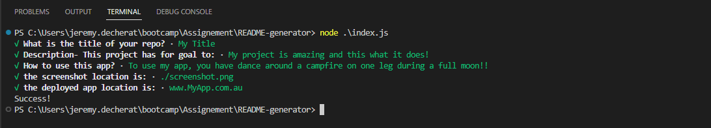

# README-generator

[](https://opensource.org/licenses/Apache-2.0)

## Description
This project is here to help you create a well structured README file.

## Installation
Remember to install all packages used in this app by running the command below:

  ```sh
  npm install
  ```

## Usage
Open the terminal in the location where this a is located.
Simply run the command 
```sh
node ./index.js
```
and answer the question promted on the terminal



There are no deployed application for this app as it runs on your local terminal.

You can however find this README file on the web page following the link below

https://gator2-0.github.io/README-generator/